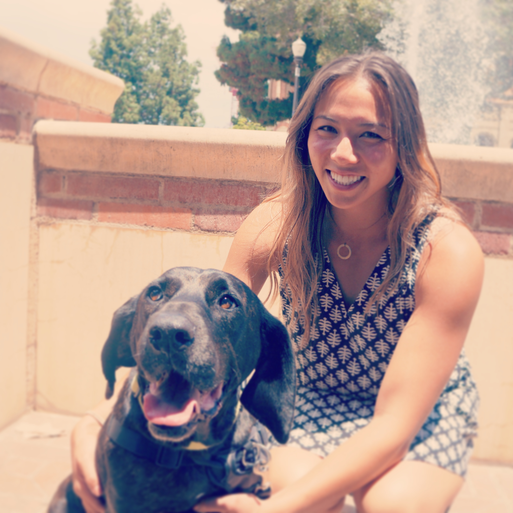

## Hi, I'm Su.

I am currently the [Director of Quantitative Research at the Center for Neighborhood Engaged Research and Science](https://www.cornersresearch.org/team/susan-burtner) at Northwestern University. I completed my PhD in Geography (studying spatial optimization) at the University of California, Santa Barbara. Before that, I was a research associate in the Geographic Information Science and Technology group at Oak Ridge National Laboratory. And even before that, I earned a master's degree in urban spatial analytics at the University of Pennsylvania following a bachelor's degree in operations research and management science at the University of California, Berkeley. I consider the Sacramento area home but love my entire home state of California deeply.

**Spatial data science**, **computational social science**, **network science**, **geographic information science**... these are my things (see my [CV](cv.html)). But I enjoy a lot of other things too, like surfing, paddling (outrigger canoe and dragonboat), Olympic weightlifting, playing basketball, and visiting breweries with my pets. I strongly believe in having an identity outside of work, but thankfully I am passionate about that as well.

### About this website

I created this website to daylight past and current projects. There are tabs for research and service or passion projects. The [research](research.html) tab highlights research projects, while the [passion projects](passion_projects.html) tab highlights those projects produced from coursework, through service, or in my free time (software if relevant are listed). This website is not an exhaustive collection of everything I have ever done, and updates may happen haphazardly. Please don't hesitate to ask questions or connect using one of the links in the header.

