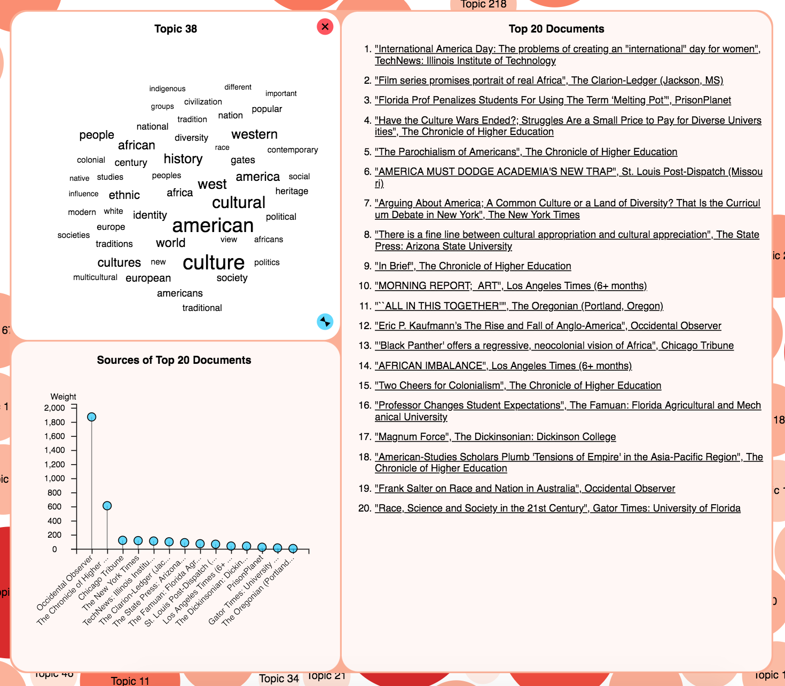
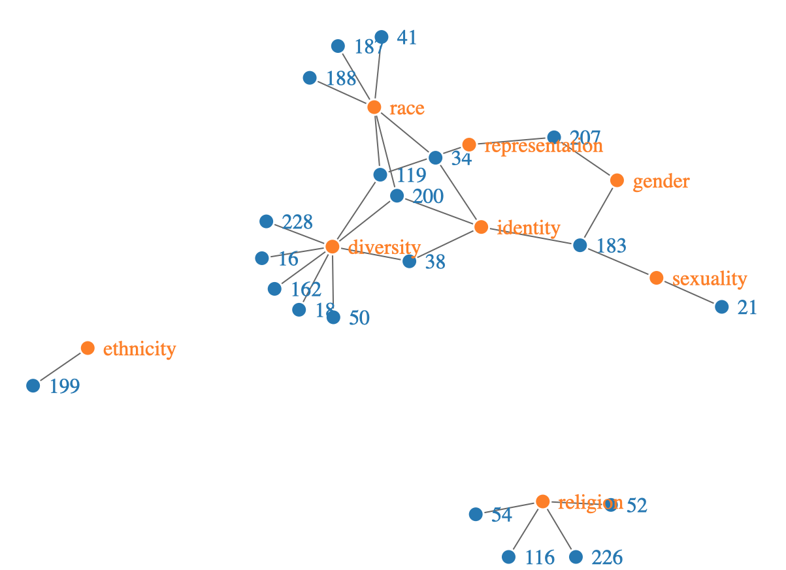

# {.tabset}

## COVID-19, 2021

### COVID-19 and Minimizing Micro-Spatial Interactions

#### Abstract

COVID-19, the novel coronavirus that has disrupted lives around the world, continues to challenge how humans interact in public and shared environments. Repopulating the micro-spatial setting of an office building, with virus spread and transmission mitigation measures, is critical for a return to normalcy. Advice from public health experts, such as maintaining physical distancing from others and well-ventilated spaces, is essential, yet there is a lack of sound guidance on configuring office usage that allows for a safe return of workers. This paper highlights the potential for decision-making and planning insights through location analytics, particularly within an office setting. Proposed is a spatial analytic framework addressing the need for physical distancing and limiting worker interaction, supported by geographic information systems, network science, and spatial optimization. The developed modeling approach addresses dispersion of assigned office spaces as well as associated movement within the office environment. This can be used to support the design and utilization of offices in a manner that minimizes the risk of COVID-19 transmission. Our proposed model produces two main findings: 1) that the consideration of minimizing potential interaction as an objective has implications for the safety of work environments and 2) that current social distancing measures may be inadequate within office settings. Our results show that leveraging exploratory spatial data analyses through the integration of geographic information systems, network science, and spatial optimization enables the identification of workspace allocation alternatives in support of office repopulation efforts.

Link to article [here](https://dl.acm.org/doi/10.1145/3486970).

## Urban Mobility, 2021

### Urban Mobility and Segregation Examined through Networked Travel Activity

#### Abstract

Individuals make travel decisions every day that feed into a vast network of spatial interactions. Unfortunately for some, ongoing economic, social, and psychological effects related to the United States’ history of racism, segregation, and discrimination have led to significant disparities in urban mobility across racial groups (Ray and Preston 2009). The effect of segregation in residential neighborhoods has been extensively studied, and more attention is being brought to other spatial contexts in which people interact. However, comparatively little research has taken a comprehensive approach to both segregation and urban mobility by analyzing residential, work, and social environments together. The utility of this approach lies in the ability to characterize physical spaces by their potential for interaction between racial groups, and whether or not group networks of activity reveal the different accessibility levels of neighborhoods in an area. This chapter seeks to address how networks and associated metrics can help to explain broad urban mobility patterns and the differences that exist between racial groups. In order to model urban mobility, we first construct networks of travel activity based on race. We then derive various network-based measures and a neighborhood-interaction potential matrix that compares travel between neighborhoods in our study area. We present results for the Los Angeles and Orange County area as a case study because it has a large, diverse population and continues to be a focus of segregation research (Johnston et al. 2006).

Link to book chapter [here](https://www.elgaronline.com/view/edcoll/9781788114707/9781788114707.00024.xml).

## SDSS, 2021

*__Software used__: Python, Google Colab notebook*

 

### Spatial Optimization for Planning and Decision-making

Getting deeper into the nuanced field of spatial data science, I decided to organize a session at the 2021 Spatial Data Science Symposium, held virtually and organized by some wonderful folks in my department's Space Time Knowledge Organization Laboratory. I recruited my fellow labmates (advisor: UCSB Geography professor Alan Murray) to help me create and present a session tutorial on "Spatial Optimization for Planning and Decision-Making," a gentle introduction to spatial optimization for a land management scenario. (All data is the property of Alan Murray, and permission is needed to use the data and replicate the code.)

 

 *The Colab (.* 

## WE1S, 2020

### The WhatEvery1Says Project

I am grateful to have had the opportunity to be a research assistant on the WhatEvery1Says project (WE1S) from 2018 to 2020. The project, led by UCSB English professor Alan Liu and an incredibly talented group of co-PIs and project managers from CSU Northridge and the University of Miami, used digital humanities methods to study media discourse about the humanities through large corpora of varying authorship:

> The project concentrates on, but is not limited to, journalistic articles in the U.S. available in digital textual form beginning circa 1981. Other materials include social media. Our hypothesis is that digital methods can help us learn new things about how the humanities have been portrayed in public discourse. For example, are there sub-themes beneath the familiar dominant clichés and memes? Are there hidden connections or mismatches between the “frames” (premises, metaphors, and narratives) of those arguing for and against the humanities? Where do the humanities fit among other topics in public discussion? How do different sources (for example, mainstream versus student newspapers) or different parts of the nation or world compare in the way they talk about the humanities? And in what way—if to any significant degree at all—does the media position racial, ethnic, gender, first-generation student and other social groups in relation to the humanities?

I primarily worked on the Social Groups team, which explored themes related to race, gender, sexuality, and first-generation to college status. I not only worked with the topic models synthesizing results, I also leveraged my experience programming and making maps to create several visualizaions (see below). Part of our work trying to find connections between social groups and their portrayal in media led us to explore additional methods such as word embeddings (vectorized forms of words) to enhance our understanding of word similarity and the significance of who says what "where." A detailed summary of our results can be found [here](https://we1s.ucsb.edu/).

 

 *A screenshot of a typical topic bubble visualization used to study topics.* 

 

 *Semantic network of key terms and the topics, identified by number, that they are in (created with R and D3).* 

 

<iframe src="we1s/webmap.html" title="WE1S Map" width="1000" height="500"></iframe>

 *A racial dot density map overlaid by the locations of HSIs, HBCUs, women's colleges and universities, and tribal colleges.* 

## AAG Presentation, 2017

### Generating Building Exterior Wall Material Estimates Using Google Street View Imagery

When I was working at Oak Ridge National Laboratory (ORNL), I was tasked with populating and managing a spatial database on global building information. Sometimes we would not have building information for parts of countries or entire countries, so I explored how we could leverage Google Street View imagery to improve the spatial coverage of our database. This led me to test out how to use the Google Street View API to obtain oblique (street level) imagery, scale that to extract thousands of labeled images of buildings based on known addresses and exterior wall material types (leveraging ORNL access to other building databases), and then train a convolutional neural network (CNN) to detect "brick" or "no brick". I did most of my API calls, labeling, and automated file organization in Python. I implemented the CNN architecture [LeNet](http://yann.lecun.com/exdb/publis/pdf/lecun-01a.pdf), modified some parameters, and ran the model on an ORNL Linux machine.

 *AAG presentation, 2017.* 

 

Link to the slides from the American Association of Geographers (AAG) 2017 Annual Meeting, where I presented this work, [here](https://nbviewer.jupyter.org/github/sburtner/sburtner.github.io/blob/1df211e129a9352a0ca8152a64ed08be025c750a/images/AAG_2017.pdf).

## MUSA Capstone, 2015

### Using GIS to Support In-Flight Operations in the Event of an Airport Outage

For my master's of urban spatial analytics degree (MUSA), I had to complete a capstone project, which was like a master's thesis. My project was titled "Using GIS to Support In-Flight Operations in the Event of an Airport Outage." My master's committee included Professors Amy Hillier and Megan Ryerson from the University of Pennsylvania. They were incredible scholars, instructors, and mentors. An image of the poster I created based on my paper is below.

 *MUSA Capstone project, completed May 2015.* 

 

This work can be seen in the [Esri Map Book, Volume 31: 168-169, Esri Press](https://esripress.esri.com/display/index.cfm?fuseaction=display&websiteID=309&moduleID=0).

# {-}

